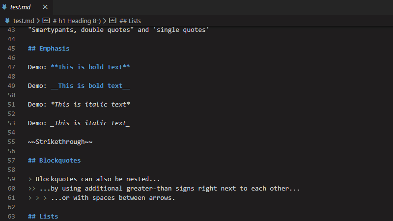
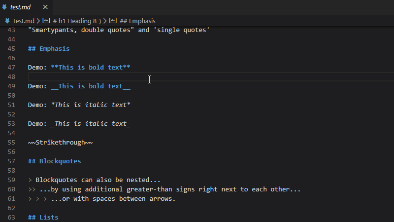

# Aspose.HTML Markdown Converter

Aspose.HTML MD Converter is built with [Aspose.HTML Cloud](https://products.aspose.cloud/html/family)
Converter allows converting Markdown to HTML and PDF format.

## Features

Converter supports the following commands:

* Convert MD to PDF
* Convert MD to HTML
* Export Converter settings

By default, all actions run in the current directory.

## Requirements

We use the `node-fetch` module to makes [API calls](https://docs.aspose.cloud/display/htmlcloud/).

## Usage

### Command Palette

1. Open the Markdown file
1. Press `F1` or `Ctrl+Shift+P`
1. Type `Aspose:` and select below
   * `Aspose: Export Converter settings)`
   * `Aspose: Convert MD to PDF`
   * `Aspose: Convert MD to HTML`

### Menu

1. Open the Markdown file
1. Right click and select below
   * `Aspose: Convert MD to PDF`
   * `Aspose: Convert MD to HTML`

## Extension Settings

Markdown Converter contributes the following settings:

* `aspose-html-md-converter.outputDirectory`: Location for output files. Default is `.` (current).
* `aspose-html-md-converter.paper.orientation`: Paper orientation for PDF files. Accepted values `Portrait` or `Landscape`.
* `aspose-html-md-converter.paper.size`: Paper Size [`A0`, `A1`, `A2`, `A3`, `A4`, `A5`, `A6`, `Letter`, `Legal`]. The value `Custom` means using options `Width` and `Height` instead Paper Size.
* `aspose-html-md-converter.paper.width`: Paper Width, accepts values labeled with units(mm, cm, in, px).
* `aspose-html-md-converter.paper.height`: Paper Height, accepts values labeled with units(mm, cm, in, px).
* `aspose-html-md-converter.margin.top`: Top margin (units: mm, cm, in, px).
* `aspose-html-md-converter.margin.bottom`: Bottom margin (units: mm, cm, in, px).
* `aspose-html-md-converter.margin.right`: Right margin (units: mm, cm, in, px).
* `aspose-html-md-converter.margin.left`: Left margin (units: mm, cm, in, px)."

## Known Issues

* MD-to-PDF conversion: The `@page` CSS at-rule can be applied incorrectly.

## Release Notes

### 0.0.1

Initial release of Aspose.HTML Markdown Converter
